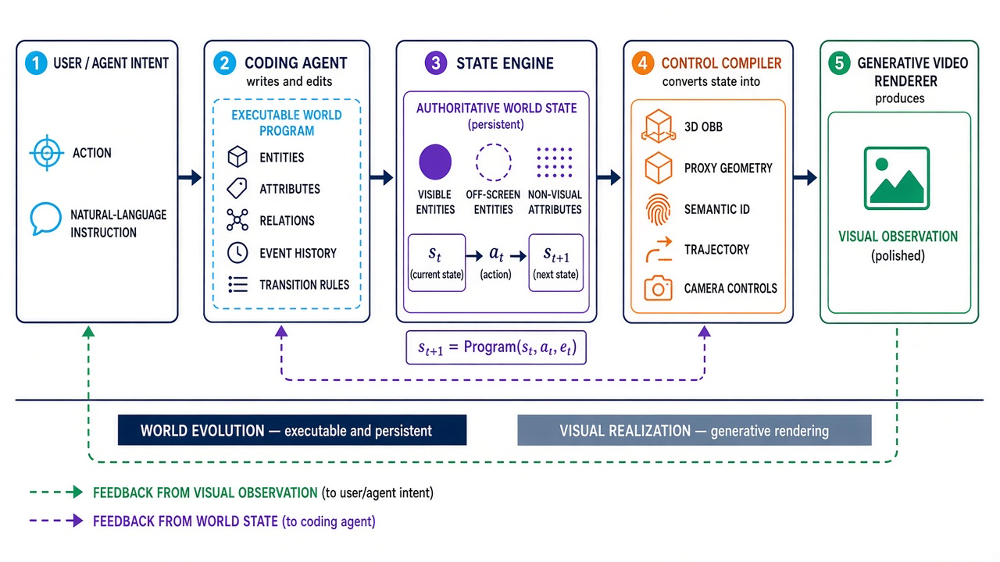

# Awesome Code World Models

A curated collection of papers, models, datasets, benchmarks, and resources on **Code World Models (CWMs)**—world models whose state and dynamics are represented, generated, or maintained as executable code.

> **Primary focus:** code as the persistent, programmable “brain” of an external visual, physical, or interactive world. Software-execution world models are retained as a separate second direction because the term CWM is also used there.

## What is a Code World Model?

A **Code World Model** represents an external world's entities, state, relations, events, and transition rules as an executable program. Given the current authoritative state $s_t$, an action $a_t$, and optional events $e_t$, executing the program advances the world:

$$
s_{t+1} = \operatorname{Program}(s_t, a_t, e_t)
$$

The program may be written by a coding agent, induced from observations and interactions, synthesized from a specification, or manually authored. In visual CWMs, a compiler converts the updated state into spatial controls—such as 3D boxes, proxy geometry, trajectories, semantic IDs, and camera paths—and a generative renderer turns those controls into video observations. This separation lets code preserve exact, persistent, off-screen, and non-visual facts while a neural model focuses on appearance.

### Inclusion Criteria

- Executable state and rule systems coupled to neural image or video renderers.
- World models learned or generated as code, probabilistic programs, PDDL, or simulator programs.
- Coding agents that infer, edit, verify, and plan with executable world representations.
- Explicit-state world models that clarify the state/dynamics/rendering decomposition.
- Software-execution world models, kept in their own clearly labeled direction.

### Exclusion Criteria

- Ordinary code generation without an executable model of world dynamics.
- Generic game engines or simulators that are not generated, induced, or part of a world-model contribution.
- Pixel-only or latent video world models with no explicit programmatic state, except as contextual related work.
- Coding agents that neither construct nor use a world model.

  

## Contents

- [Programmatic Visual World Models](#programmatic-visual-world-models)
- [Explicit-State Models and Generative Renderers](#explicit-state-models-and-generative-renderers)
- [World Models as Executable Programs](#world-models-as-executable-programs)
- [Programmatic-World Benchmarks](#programmatic-world-benchmarks)
- [Adjacent Neural Visual World Models](#adjacent-neural-visual-world-models)
- [Software World Models](#software-world-models)
  - [Repository and Terminal World Models](#repository-and-terminal-world-models)
  - [Program Execution and State Models](#program-execution-and-state-models)
  - [Software-World Evaluation and Analysis](#software-world-evaluation-and-analysis)
  - [Software-World Benchmarks](#software-world-benchmarks)
- [Terminology and Scope](#terminology-and-scope)
- [Contributing](#contributing)

## Tag Legend

- `code-state` — code is the authoritative world-state representation
- `agent-written` — a coding agent creates or edits world programs
- `induced` — executable dynamics are learned from observations or interaction
- `neural renderer` — a generative model realizes visual observations from structured controls
- `explicit state` — dynamics and observations are modeled separately
- `software world` — predicts the behavior of programs or software environments
- `transition` / `trace` / `outcome` / `reward` — software-world prediction targets
- `repo` / `terminal` — repository-scale or command-line software environments
- `open code` / `open model` — public implementation or weights are available

## Programmatic Visual World Models

These works most directly match this repository's primary focus: executable programs maintain or reconstruct a world, and visual observations are produced through a rendering pipeline.

- **Programmable World Model (PWM)** — *Programmable World Model*. arXiv 2026. A coding agent translates instructions into entity states and executable transition rules; a lightweight engine maintains persistent off-screen and non-visual state; state-augmented 3D oriented bounding boxes are compiled into controls for a pretrained video renderer. Introduces CombatStateBench. `code-state` `agent-written` `neural renderer` `open code`
  [Paper](https://arxiv.org/abs/2609.10540) · [Project](https://alaya-lab.github.io/pwm/) · [Code](https://github.com/AlayaLab/pwm)

- **Code World Model** — *Code World Model: Coding Agent as World Brain*. arXiv 2026. A coding agent continually creates and updates executable world state and rules, compiles them into proxy videos and structured prompts, and conditions MiniMax-H3 to render open-ended visual observations. `code-state` `agent-written` `neural renderer` `open code`
  [Paper](https://arxiv.org/abs/2608.25927) · [Project](https://buaacyw.github.io/cwm/) · [Code](https://github.com/buaacyw/code-world-model) · [Model](https://huggingface.co/NTU-yiwen/awm-minimax-h3-new1344-lora-checkpoints)

- **Code as Worlds** — *Code as Worlds: Agentic Discovery of Executable World Representations for Physical Reasoning*. arXiv 2026. Represents physical composition, dynamics, and appearance as executable code, discovered through a propose–execute–render–verify loop from text or video evidence. `code-state` `agent-written` `induced` `open code`
  [Paper](https://arxiv.org/abs/2608.27549) · [Project](https://mirros-lab.github.io/code-as-world/) · [Code](https://github.com/MirroS-Lab/Code-as-World)

- **VisPhyWorld** — *VisPhyWorld: Probing Physical Reasoning via Code-Driven Video Reconstruction*. arXiv 2026. Requires multimodal models to infer executable 2D/3D physics simulation code from visual evidence and evaluates the re-rendered future, making the inferred dynamics inspectable and falsifiable. `code-state` `agent-written` `induced` `open code`
  [Paper](https://arxiv.org/abs/2602.13294) · [Project](https://tiger-ai-lab.github.io/VisPhyWorld/) · [Code](https://github.com/TIGER-AI-Lab/VisPhyWorld)

## Explicit-State Models and Generative Renderers

These systems share the key separation between authoritative state/dynamics and visual realization, but their state transitions are learned or conventionally authored rather than maintained as open-ended code by an agent.

- **Magpie** — *Magpie: Real-Time World Renderer for Interactive Games*. arXiv 2026. A conventional game engine owns rules and state while a separate generative render server converts white-box frames into high-fidelity real-time video. `explicit state` `neural renderer`
  [Paper](https://arxiv.org/abs/2608.27168) · [Project](https://zhanxy.xyz/Magpie-website) · [Data](https://huggingface.co/datasets/MogoAI/Magpie_lite)

- **Marionette** — *Marionette: Predicting World States, Rendering Geometry, Painting Appearance*. arXiv 2026. Predicts explicit articulated 3D state, deterministically converts it into pose-control video, and leaves only appearance synthesis to video diffusion; state-level rules can directly repair rollouts. `explicit state` `neural renderer` `open code` `open model`
  [Paper](https://arxiv.org/abs/2608.14530) · [Project](https://alayalab.github.io/Marionette/) · [Code](https://github.com/AlayaLab/Marionette) · [Model](https://huggingface.co/AlayaLab/Marionette)

- **MASS** — *MASS: Multiplayer World Models with Authoritative Shared State*. arXiv 2026. A learned logic engine advances a global typed state, while independent neural renderers produce consistent player-specific views. `explicit state` `neural renderer`
  [Paper](https://arxiv.org/abs/2608.06257) · [Project](https://alaya-lab.github.io/MASS/)

- **StatePlay** — *StatePlay: State-Aware Game World Models for Mechanics-Consistent Generation*. arXiv 2026. Jointly predicts explicit game variables and visual content so mechanics such as health, timers, and skill meters constrain generated gameplay. `explicit state` `neural renderer` `open code` `open model`
  [Paper](https://arxiv.org/abs/2607.26754) · [Project](https://jimntu.github.io/stateplay_page/) · [Code](https://github.com/Jimntu/StatePlay) · [Model](https://huggingface.co/onepiece1999/StatePlay)

## World Models as Executable Programs

These works learn, synthesize, or repair executable transition models for planning and simulation, usually without a neural visual renderer.

- **VisualPatchWorld** — *VisualPatchWorld: Code World Models as Latent Structured Representations for Planning*. arXiv 2026. Induces structured executable dynamics from visual trajectories for planning across navigation and continuous-control tasks. `induced` `open code`
  [Paper](https://arxiv.org/abs/2607.25236) · [Code](https://github.com/HKBU-KnowComp/VisualPatchWorld)

- **Mind-Studio** — *Mind-Studio: Executable World Models with Lookahead Evaluation for Partially Observable Games*. arXiv 2026. Synthesizes standalone transition-and-render programs for partially observable Atari games and uses them for lookahead evaluation. `agent-written` `induced` `open code`
  [Paper](https://arxiv.org/abs/2606.16070) · [Code](https://github.com/HKBU-KnowComp/MindStudio)

- **Executable World Models for ARC-AGI-3** — *Executable World Models for ARC-AGI-3 in the Era of Coding Agents*. arXiv 2026. A coding agent maintains, verifies, simplifies, and plans through persistent Python models of interactive games. `agent-written` `induced` `open code`
  [Paper](https://arxiv.org/abs/2605.05138) · [Code](https://github.com/astroseger/arc-3-agents-baseline1)

- **PatchWorld** — *PatchWorld: Gradient-Free Optimization of Executable World Models*. arXiv 2026. Induces persistent Python belief-state programs from offline trajectories through counterexample-guided repair. `induced` `open code`
  [Paper](https://arxiv.org/abs/2605.30880) · [Code](https://github.com/HKBU-KnowComp/PatchWorld)

- **Code World Models for General Game Playing** — ICLR 2026. Compiles natural-language game rules and demonstrations into executable Python functions for transitions, legal actions, observations, rewards, and termination, then plans with MCTS. `agent-written`
  [Paper](https://proceedings.iclr.cc/paper_files/paper/2026/hash/d8a12fde9e72444e1b356e8c37e53753-Abstract-Conference.html)

- **PoE-World** — *PoE-World: Compositional World Modeling with Products of Programmatic Experts*. NeurIPS 2025 Spotlight. Learns stochastic, partially observable Atari dynamics as a weighted product of small LLM-synthesized Python programs. `agent-written` `induced` `open code`
  [Paper](https://proceedings.neurips.cc/paper_files/paper/2025/hash/262dd62fd1bbb30d6a6b4d578f5e65ff-Abstract-Conference.html) · [Project](https://topwasu.github.io/poe-world) · [Code](https://github.com/topwasu/poe-world)

- **POMDP Coder** — *LLM-Guided Probabilistic Program Induction for POMDP Model Estimation*. 2025. Generates probabilistic programs for initial state, transition, observation, and reward functions under partial observability. `agent-written` `induced`
  [Paper](https://arxiv.org/abs/2505.02216)

- **FactorSim** — *FactorSim: Generative Simulation via Factorized Representation*. NeurIPS 2024. Generates complete game and robotics simulations from language using a factorized POMDP representation. `agent-written` `open code`
  [Paper](https://proceedings.neurips.cc/paper_files/paper/2024/hash/9f35ec2f7f403ef2c83d65b581df10bc-Abstract-Conference.html) · [Project](https://cs.stanford.edu/~sunfanyun/factorsim/) · [Code](https://github.com/sunfanyunn/FactorSim)

- **GIF-MCTS** — *Generating Code World Models with Large Language Models Guided by Monte Carlo Tree Search*. NeurIPS 2024. Searches over executable simulator programs using environment interaction and downstream policy performance, and introduces the Code World Models Benchmark (CWMB). `agent-written` `induced` `open code`
  [Paper](https://proceedings.neurips.cc/paper_files/paper/2024/hash/6f479ea488e0908ac8b1b37b27fd134c-Abstract-Conference.html) · [Project](https://sites.google.com/view/code-world-models/home) · [Code](https://github.com/nicoladainese96/code-world-models)

- **WorldCoder** — *WorldCoder, a Model-Based LLM Agent: Building World Models by Writing Code and Interacting with the Environment*. NeurIPS 2024. Induces executable transition and reward programs from interaction, verifies them against experience, and plans inside the learned model. `agent-written` `induced` `open code`
  [Paper](https://proceedings.neurips.cc/paper_files/paper/2024/hash/820c61a0cd419163ccbd2c33b268816e-Abstract-Conference.html) · [Project](https://haotang1995.github.io/projects/worldcoder) · [Code](https://github.com/haotang1995/WorldCoder)

## Programmatic-World Benchmarks

- **CombatStateBench** — Long-horizon entity count and persistent-state evaluation with moving cameras, off-screen entities, and irreversible events. [Paper](https://arxiv.org/abs/2609.10540) · [Code](https://github.com/AlayaLab/pwm)
- **VisPhyBench** — 209 scenes from 108 physical templates for evaluating code-driven physical reconstruction and re-simulation. [Paper](https://arxiv.org/abs/2602.13294) · [Code and Data](https://github.com/TIGER-AI-Lab/VisPhyWorld)
- **CWMB** — 18 environments for evaluating induced executable transition models through model fidelity and downstream policy learning. [Paper](https://arxiv.org/abs/2405.15383) · [Code and Data](https://github.com/nicoladainese96/code-world-models)
- **Text2World** — Generation of executable PDDL world models from natural-language descriptions. [Paper](https://aclanthology.org/2025.findings-acl.1337/) · [Code and Data](https://github.com/Aaron617/text2world)

## Adjacent Neural Visual World Models

These representative interactive video world models provide important rendering and action-conditioning context, but do not use an authoritative executable program as world state.

- **YUME** — *YUME: An Interactive World Generation Model*. arXiv 2025. [Paper](https://arxiv.org/abs/2507.17744)
- **GameNGen** — *Diffusion Models Are Real-Time Game Engines*. arXiv 2024. [Paper](https://arxiv.org/abs/2408.14837) · [Project](https://gamengen.github.io/)
- **DIAMOND** — *Diffusion for World Modeling: Visual Details Matter in Atari*. NeurIPS 2024. [Paper](https://arxiv.org/abs/2405.12399) · [Code](https://github.com/eloialonso/diamond)
- **Genie** — *Genie: Generative Interactive Environments*. ICML 2024. [Paper](https://arxiv.org/abs/2402.15391) · [Project](https://sites.google.com/view/genie-2024/)

## Software World Models

This second direction uses “Code World Model” to mean a learned model of **software execution**: how code, commands, tools, repositories, and tests change a computational environment. Here, code is the modeled world rather than the representation of an external world.

### Repository and Terminal World Models

- **Qwen-AgentWorld** — *Qwen-AgentWorld: Language World Models for General Agents*. arXiv 2026. A native next-observation model trained across seven agent environments; its Terminal and SWE domains predict shell, file-system, edit, compiler, and test feedback. `transition` `repo` `terminal` `open model`
  [Paper](https://arxiv.org/abs/2606.24597) · [Code](https://github.com/QwenLM/Qwen-AgentWorld) · [Model](https://huggingface.co/Qwen/Qwen-AgentWorld-35B-A3B) · [AgentWorldBench](https://huggingface.co/datasets/Qwen/AgentWorldBench)

- **ECHO** — *ECHO: Terminal Agents Learn World Models for Free*. arXiv 2026. Adds an environment-observation prediction objective to terminal-agent RL, learning command effects from stdout, errors, files, logs, and traces already present in rollouts. `transition` `terminal`
  [Paper](https://arxiv.org/abs/2605.24517)

- **SWE-World** — *SWE-World: Building Software Engineering Agents in Docker-Free Environments*. arXiv 2026. Replaces physical repository execution with learned transition and reward models that simulate command outcomes and final test feedback. `transition` `reward` `repo`
  [Paper](https://arxiv.org/abs/2602.03419) · [Code](https://github.com/RUCAIBox/SWE-World)

- **CWM** — *CWM: An Open-Weights LLM for Research on Code Generation with World Models*. arXiv 2025. A 32B model mid-trained on Python execution traces and agent interactions in containerized software environments. `transition` `trace` `repo` `open model`
  [Paper](https://arxiv.org/abs/2510.02387) · [Project](https://ai.meta.com/research/publications/cwm-an-open-weights-llm-for-research-on-code-generation-with-world-models/) · [Code](https://github.com/facebookresearch/cwm) · [Model](https://huggingface.co/facebook/cwm)

### Program Execution and State Models

- **Neural Debugger** — *Towards a Neural Debugger for Python*. arXiv 2026. Models forward and inverse Python execution conditioned on debugger actions such as step-into, step-over, step-return, and breakpoints. `transition` `trace` `outcome`
  [Paper](https://arxiv.org/abs/2603.09951)

- **Self-Execution Simulation** — *Self-Execution Simulation Improves Coding Models*. arXiv 2026. Trains step-by-step execution simulation with supervised traces and verifiable RL, then uses predicted test outcomes for self-verification and repair. `trace` `outcome`
  [Paper](https://arxiv.org/abs/2604.03253)

- **ExecVerify** — *ExecVerify: White-Box RL with Verifiable Stepwise Rewards for Code Execution Reasoning*. ACL 2026. Rewards correct next-statement, variable-value, variable-type, and final-output predictions before transferring the capability to code generation. `trace` `outcome`
  [Paper](https://aclanthology.org/2026.acl-long.631/) · [Code, Data, and Models](https://github.com/tlx000000001/ExecVerify)

- **Execution Tuning** — *What I Cannot Execute, I Do Not Understand: Training and Evaluating LLMs on Program Execution Traces*. arXiv 2025. Trains line- and instruction-level execution models and studies compact and dynamic state representations for long rollouts. `trace` `outcome`
  [Paper](https://arxiv.org/abs/2503.05703)

- **SemCoder** — *SemCoder: Training Code Language Models with Comprehensive Semantics Reasoning*. NeurIPS 2024. Learns execution-aware semantic traces and execution monologues for generation and repair. `trace` `outcome`
  [Paper](https://proceedings.neurips.cc/paper_files/paper/2024/hash/6efcc7fd8efeee29a050a79c843c90e0-Abstract-Conference.html) · [Code, Data, and Models](https://github.com/ARiSE-Lab/SemCoder)

- **TRACED** — *TRACED: Execution-Aware Pre-training for Source Code*. ICSE 2024. Predicts execution coverage and quantized runtime variable states from source code and inputs. `trace` `outcome`
  [Paper](https://arxiv.org/abs/2306.07487) · [Code](https://github.com/ARiSE-Lab/TRACED_ICSE_24)

- **CodeExecutor** — *Code Execution with Pre-trained Language Models*. Findings of ACL 2023. A learned Python executor that predicts line-by-line traces and final outputs, with execution pre-training transferred to code intelligence tasks. `trace` `outcome`
  [Paper](https://aclanthology.org/2023.findings-acl.308/) · [Code and Data](https://github.com/microsoft/CodeBERT/tree/master/CodeExecutor)

- **Learning to Execute** — *Learning to Execute*. arXiv 2014. A foundational study training recurrent networks to predict program outputs directly from source code and inputs. `outcome`
  [Paper](https://arxiv.org/abs/1410.4615) · [Code](https://github.com/wojciechz/learning_to_execute)

### Software-World Evaluation and Analysis

- **Towards Evaluation of Implicit Software World Models in Coding LLMs** — DL4Code at ICML 2026. Evaluates test outcomes, exceptions, memory, runtime, and profiler predictions on library-level cases derived from SWE-bench Verified.
  [Paper](https://arxiv.org/abs/2606.27406) · [Code](https://github.com/JetBrains-Research/cwm-execution-tracer) · [Data](https://huggingface.co/datasets/JetBrains-Research/cwm-benchmarks-dl4c-benchmark)

- **Debugging Code World Models** — 2026. Separates action-generation failures from state-propagation failures in long execution rollouts and analyzes the effect of dense state supervision.
  [Paper](https://arxiv.org/abs/2602.07672) · [Blog](https://babak70.github.io/code-world-models-blog/)

### Software-World Benchmarks

Benchmarks are listed here only when they directly test learned execution or software-environment prediction; they are not themselves Code World Models.

- **2026**
  - **AgentWorldBench** — Next-observation prediction across agent environments, including dedicated Terminal and SWE subsets. [Dataset](https://huggingface.co/datasets/Qwen/AgentWorldBench)
  - **DexBench** — Paired forward-execution and counterfactual input-mutation tasks. [Paper](https://aclanthology.org/2026.acl-long.735/)
  - **CoRE** — Fine-grained intermediate-state and implementation-invariance evaluation. [Paper](https://aclanthology.org/2026.findings-acl.460/) · [Code](https://github.com/ZJUSig/CoRE)
  - **CES** — Evaluates the coherence and cross-input consistency of code-execution reasoning. [Paper](https://arxiv.org/abs/2510.15079) · [Code](https://github.com/Intelligent-CAT-Lab/CES)
  - **PLSemanticsBench** — Tests final states, traces, and semantic rules under both standard and deliberately altered programming-language semantics. [Paper](https://arxiv.org/abs/2510.03415) · [Code](https://github.com/EngineeringSoftware/PLSemanticsBench)

- **2025**
  - **SURGE** — 1,160 problems spanning multi-language, repository-level, scientific, environment-dependent, and high-cost surrogate execution. [Paper](https://aclanthology.org/2025.emnlp-main.162/) · [Code and Data](https://github.com/Imbernoulli/SURGE)
  - **R-Eval** — Evaluates coverage, intermediate state and type, next statement, output, and execution consistency. [Paper](https://arxiv.org/abs/2403.16437) · [Project](https://r-eval.github.io/)
  - **ThrowBench** — Runtime-exception prediction over 2,466 programs in four languages. [Paper](https://arxiv.org/abs/2503.04241) · [Code and Data](https://github.com/giganticode/throwbench)
  - **BigO(Bench)** — Runtime and memory-complexity prediction over programming problems and solutions. [Paper](https://arxiv.org/abs/2503.15242) · [Code and Data](https://github.com/facebookresearch/BigOBench)

- **2024**
  - **CRUXEval** — Input and output prediction for short Python functions. [Paper](https://proceedings.mlr.press/v235/gu24c.html) · [Code and Data](https://github.com/facebookresearch/cruxeval)
  - **Code Simulation Challenges** — Tests straight-line execution, critical paths, redundant computation, loops, and sorting. [Paper](https://arxiv.org/abs/2401.09074) · [Code and Data](https://github.com/EmanueleLM/CodeSimulation)

## Terminology and Scope

“Code World Model” currently refers to several related but distinct ideas:

1. **Programmatic external worlds** — code represents another world's entities, state, and dynamics. This is the repository's primary meaning.
2. **Code-state visual worlds** — executable state is compiled into controls for a neural image or video renderer. PWM and *Coding Agent as World Brain* are the clearest examples.
3. **Software world models** — a learned model predicts how source code, commands, repositories, or tests execute. Meta CWM and SWE-World use this meaning.

The boundary is representation, not appearance: a world may be visually simple and still qualify if its dynamics are executable programs. Conversely, a photorealistic interactive video model is adjacent rather than core if all persistent state remains implicit in pixels or latent features.

## Contributing

Contributions are welcome. Before opening a pull request, please check that the resource:

1. Uses executable code or another programmatic representation as a world model, couples explicit state to a generative renderer, **or** clearly belongs to the separately labeled software-world direction.
2. Does more than generate code: the program must represent, advance, reconstruct, evaluate, or support planning in a world.
3. Links to a canonical paper/project page and, when available, public code, data, and model weights.
4. Includes one sentence explaining the represented world, how its state evolves, and how observations are rendered.

Please keep entries reverse chronological within each section and prefer archival conference pages over secondary summaries.

## Acknowledgements

The organization of this repository is inspired by [Awesome World Models](https://github.com/knightnemo/Awesome-World-Models) and [Awesome WAM](https://github.com/OpenMOSS/Awesome-WAM). Thanks to their maintainers and to everyone building open resources for world-model research.

If you find a missing paper or a classification mistake, please open an issue or submit a pull request.
